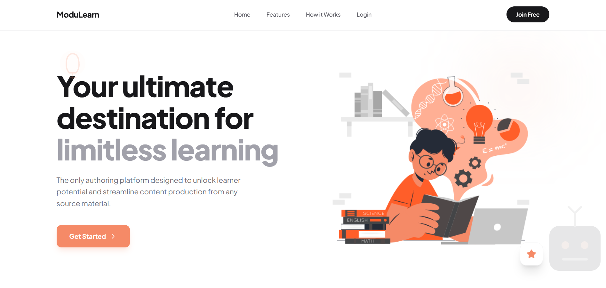
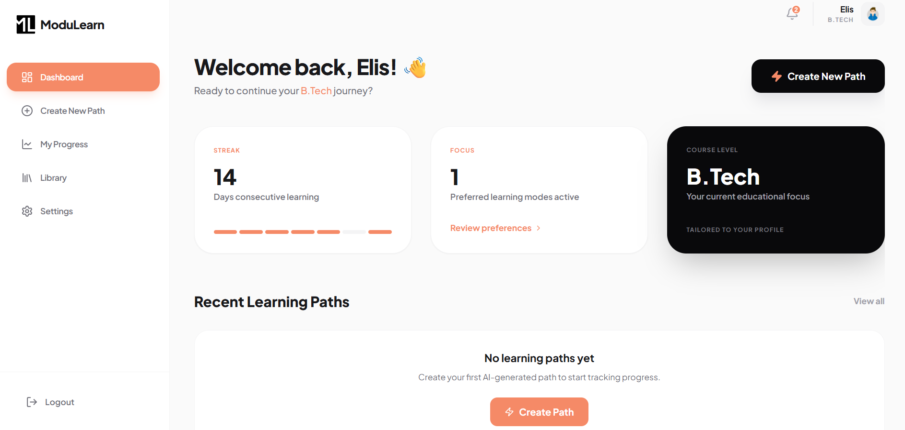

<div align="center">

# ModuLearn

### AI-Powered Learning Path Builder

Transform a topic, PDF, or URL into a structured learning path personalized to your level and learning preferences.

[](https://react.dev)
[](https://www.typescriptlang.org)
[](https://vitejs.dev)
[](LICENSE)

</div>

## What Is New

This project has evolved beyond simple topic-based generation. Current implementation includes:

- Multi-source path creation: topic text, PDF upload, and URL extraction
- Adaptive curriculum generation with learning depth and familiarity preferences
- Google OAuth sign-in with Supabase + PKCE callback handling for hash-based routing
- Interactive learning interface with AI explanations per subtopic
- Interactive BioDigital 3D anatomy viewer for biology topics
- Topic-aware YouTube recommendations with timestamp jumping
- Built-in coding practice and test execution using Judge0
- Path structuring, AI module refinement, and mindmap export
- Saved path library with progress persistence in Supabase

## Core Features

### Curriculum generation
- Generate complete learning curricula with modules and subtopics using Groq
- Tune output with:
  - Learning depth: quick overview, structured learning, deep mastery
  - Topic familiarity: new, intermediate, advanced
- Auto-adapt for school, college, or professional profiles

### Source pipelines
- Topic mode: prompt-driven generation
- PDF mode: PDF parsing, chunking, summarization, section synthesis, then curriculum generation
- URL mode: content extraction (direct/proxy strategies), normalization, curriculum generation

### Learning experience
- Structured module view with expandable subtopics
- AI explanations for selected subtopics
- Embedded BioDigital Human viewer for topic-aligned 3D biology models
- YouTube learning resources with topic timestamp support
- Coding practice workspace with Monaco editor
- Code run and test-case validation via Judge0
- Attempt history tracking per module

### Authoring and visualization
- Refine module content with AI
- Add/remove modules before saving
- Generate and download a mindmap image from your path

### Account and data
- Email/password and Google sign-in
- Onboarding-driven learner profile
- Persisted learning paths, modules, progress, and metadata in Supabase
- Library, dashboard, and settings screens

## Tech Stack

- Frontend: React 19, TypeScript, Tailwind CSS, React Router
- Build tool: Vite
- AI: Groq API, Google GenAI (for selected flows)
- Auth + DB: Supabase
- Code execution: Judge0
- Visualization: Recharts, jsMind, html2canvas
- PDF processing: pdfjs-dist

## Project Structure

```text
modulearn/
├── App.tsx
├── index.tsx
├── backend/
│   ├── groqService.ts
│   ├── pdfLearningPipeline.ts
│   └── urlLearningPipeline.ts
├── components/
├── lib/
│   ├── database.ts
│   ├── supabase.ts
│   ├── codingPractice.ts
│   ├── judge0Service.ts
│   └── topicTimestampService.ts
├── pages/
│   ├── LandingPage.tsx
│   ├── LoginPage.tsx
│   ├── SignupPage.tsx
│   ├── OnboardingPage.tsx
│   └── app/
│       ├── Dashboard.tsx
│       ├── CreatePath.tsx
│       ├── StructurePath.tsx
│       ├── LearningInterface.tsx
│       ├── LibraryPage.tsx
│       ├── ProgressPage.tsx
│       └── SettingsPage.tsx
└── package.json
```

## Quick Start

### 1) Prerequisites

- Node.js 18+
- npm

### 2) Install

```bash
git clone https://github.com/LakraAnshul/ModuLearn.git
cd ModuLearn
npm install
```

### 3) Configure environment

Create `.env` in project root.

```env
# Required for curriculum generation
VITE_GROQ_API_KEY=your_groq_key

# Required for YouTube recommendations
VITE_YOUTUBE_API_KEY=your_youtube_api_key

# Required for BioDigital 3D viewer
VITE_BIODIGITAL_DEVELOPER_KEY=your_biodigital_developer_key

# Optional BioDigital tuning
VITE_BIODIGITAL_VIEWER_BASE_URL=https://human.biodigital.com/viewer/
VITE_BIODIGITAL_DEFAULT_MODEL_ID=production/maleAdult/beating_heart_02
# JSON object string: keyword -> modelId
VITE_BIODIGITAL_TOPIC_MODEL_MAP={"heart":"production/maleAdult/beating_heart_02"}

# Optional Gemini usage in selected flows
VITE_GEMINI_API_KEY=your_gemini_key
# or
VITE_GOOGLE_API_KEY=your_google_api_key

# Optional Judge0 overrides (if not using default public CE endpoint)
VITE_JUDGE0_API_URL=https://ce.judge0.com
VITE_RAPIDAPI_KEY=your_rapidapi_key
VITE_RAPIDAPI_HOST=judge0-ce.p.rapidapi.com

# Supabase credentials currently used by the client initializer
SUPABASE_URL=https://your-project-ref.supabase.co
SUPABASE_ANON_KEY=your_supabase_anon_key
```

Notes:
- The current Supabase initializer reads `SUPABASE_URL` and `SUPABASE_ANON_KEY`.
- If those are missing, the code can fall back to hardcoded values in `lib/supabase.ts`.
- BioDigital viewer runs in an iframe and requires a valid developer key (`dk`) from your BioDigital app settings.

### 4) Run

```bash
npm run dev
```

App runs at `http://localhost:5173` by default.

## Available Scripts

```bash
npm run dev      # Start dev server
npm run build    # Production build
npm run preview  # Preview production build
```

## Supabase Setup Checklist

### Auth URL configuration

If Google OAuth redirects to localhost in production, verify these in Supabase Auth URL settings:

- Site URL: your production URL (for example `https://modulearn-9pq2.onrender.com`)
- Redirect URLs should include:
  - production origin
  - production origin with trailing slash
  - localhost for local testing

### Coding attempts table

Run SQL from `SUPABASE_CODING_ATTEMPTS_SETUP.md` to enable coding attempt history.

## Deployment (Render)

For a Render static site deployment:

- Build Command: `npm run build`
- Publish Directory: `dist`

`./dist` is also valid, but `dist` is preferred.

Because the app uses hash routing, deep-link rewrite rules are generally not required.

## Important Security Notes

- Never commit real API keys or secrets.
- Rotate exposed keys immediately if leaked.
- Keep `.env` local and private.

## Supporting Docs In Repo

- `SETUP_GROQ.md`
- `ENV_SETUP_GUIDE.md`
- `TOPIC_TIMESTAMP_SETUP.md`
- `SUPABASE_CODING_ATTEMPTS_SETUP.md`
- `IMPLEMENTATION_SUMMARY.md`
- `CHANGES_SUMMARY.md`

## Screenshots

### Landing Page


### Dashboard


### Path Generator


### Generated Path Example


### Learning Journey


### User Profiling


### User Profiling (Variant)


## License

MIT - see `LICENSE`.
