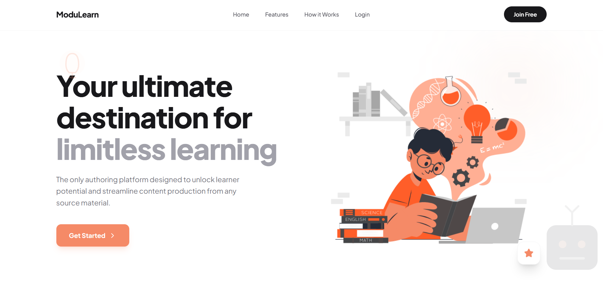
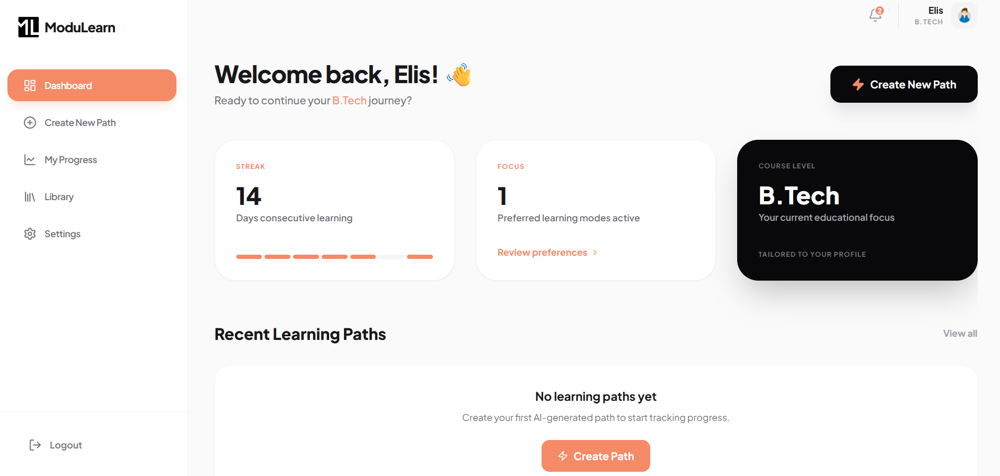

<div align="center">

# 🎓 ModuLearn

### AI-Powered Learning Path Builder

Turn any topic, PDF, or URL into a personalized, structured learning experience — complete with AI explanations, quizzes, flashcards, coding challenges, 3D models, and a persistent AI tutor.

[](https://modulearn-9pq2.onrender.com/)
[](https://react.dev)
[](https://www.typescriptlang.org)
[](https://vitejs.dev)
[](https://supabase.com)
[](LICENSE)

<br/>

🚀 **Live Demo**: [https://modulearn-9pq2.onrender.com/](https://modulearn-9pq2.onrender.com/)

</div>

---

## 📸 Screenshots

<table>
  <tr>
    <td align="center"><br/><b>Landing Page</b></td>
    <td align="center"><br/><b>Dashboard</b></td>
  </tr>
  <tr>
    <td align="center"><br/><b>Path Generator</b></td>
    <td align="center"><br/><b>Generated Path</b></td>
  </tr>
  <tr>
    <td align="center"><br/><b>Learning Interface</b></td>
    <td align="center"><br/><b>User Profiling</b></td>
  </tr>
</table>

---

## ✨ Key Features

### 🧠 Multi-Source Curriculum Generation

Create learning paths from **three** distinct input sources, each powered by AI:

| Source | How It Works |
|--------|-------------|
| **Topic** | Enter any subject — AI generates a complete, structured curriculum |
| **PDF** | Upload a document → parsed, chunked, summarized, and synthesized into modules |
| **URL** | Paste a link → content extracted (direct + proxy strategies), normalized, and turned into a curriculum |

### 🎯 Adaptive Learning Profiles

Curricula are tailored based on your individual profile:

- **Learning Depth** — Quick Overview · Structured Learning · Deep Mastery
- **Topic Familiarity** — Beginner · Intermediate · Advanced
- **User Profile** — Auto-adjusts for school students, college students, or working professionals

### 📚 Interactive Learning Interface

A comprehensive learning dashboard packed with tools for active learning:

- **AI Explanations** — Click any subtopic for an on-demand, in-depth AI-generated explanation
- **BioDigital 3D Anatomy Viewer** — For biology/medical topics, an embedded interactive 3D anatomical model is automatically matched to the current topic
- **Curated YouTube Resources** — Topic-relevant videos with **smart timestamp jumping** so you skip directly to where your subtopic is discussed
- **Multi-language Video Support** — Filter YouTube results by language (14 languages supported including Hindi, Spanish, French, Arabic, Japanese, and more)

### 💻 Integrated Coding Workspace

For programming and CS topics, a full coding environment is built right in:

- **Monaco Editor** — A VS Code-like code editor in the browser
- **Judge0 Execution Engine** — Write, run, and test code against predefined test cases without leaving the platform
- **Multi-language Support** — Python, JavaScript, C++, Java, and more
- **Attempt History Tracking** — Track coding attempts and performance over time

### 📝 AI-Powered Assessments

A robust assessment suite for knowledge validation and active recall:

| Feature | Description |
|---------|-------------|
| **Module Quizzes** | AI-generated MCQ and Numerical questions tailored to the current module's content |
| **Difficulty Levels** | Choose Easy, Medium, or Hard — question complexity adapts accordingly |
| **Final Quiz** | A cumulative exam that synthesizes content across all modules |
| **Smart Feedback** | AI-driven, difficulty-aware feedback — identifies knowledge gaps and explains *why* you got answers wrong |
| **Attempt History** | Full history of quiz attempts with scores, time taken, and per-question review |
| **Flashcards** | AI-generated flashcards for key concepts — supports flip-to-reveal and practice mode |

### 🤖 Persistent AI Teaching Assistant

A floating chatbot available across the entire platform:

- **Context-Aware** — Knows your course, current module, progress, quiz results, and user profile
- **Powered by Groq** — Uses `llama-3.3-70b-versatile` for fast, high-quality responses
- **Persistent Memory** — Chat history saved in Supabase — pick up conversations where you left off

### ✏️ Path Authoring & Visualization

Before committing to a learning path:

- **AI Module Refinement** — Click to have AI add more detail to any module
- **Add / Remove Modules** — Manually adjust the curriculum structure
- **Mindmap Export** — Generate and download a visual mindmap of your entire learning path
- **Duration Estimates** — See estimated time per module and total course length

### 👤 Account & Data Management

- **Authentication** — Email/password and Google OAuth (with PKCE flow)
- **Onboarding** — Profile-driven learner setup (education level, languages, interests)
- **Persistent Data** — Learning paths, progress, quiz attempts, chat history, and flashcards stored in Supabase
- **Library & Dashboard** — View all saved paths, track progress, and resume learning
- **Settings** — Update profile, preferences, and account details

---

## 🛠️ Tech Stack

| Layer | Technology |
|-------|-----------|
| **Frontend** | React 19, TypeScript, Tailwind CSS, React Router (hash-based) |
| **Build** | Vite 6 |
| **AI Engine** | Groq API (`llama-3.3-70b-versatile`) — curriculum, quizzes, explanations, chatbot |
| **AI Fallback** | Google GenAI (`@google/genai`) for selected flows |
| **Auth & Database** | Supabase (PostgreSQL, Auth, Google OAuth) |
| **Code Execution** | Judge0 API (sandboxed execution) |
| **Code Editor** | Monaco Editor (`@monaco-editor/react`) |
| **3D Visualization** | BioDigital Human API |
| **Video** | YouTube Data API v3 |
| **Charts & Mindmaps** | Recharts, jsMind, html2canvas |
| **PDF Processing** | pdfjs-dist (client-side parsing) |
| **Icons** | Lucide React |

---

## 📂 Project Structure

```
modulearn/
├── App.tsx                          # Root app with routing
├── index.tsx                        # Entry point
├── types.ts                         # Shared TypeScript interfaces
│
├── backend/
│   ├── groqService.ts               # AI curriculum, quiz, explanation, chat generation
│   ├── pdfLearningPipeline.ts       # PDF → parse → chunk → summarize → curriculum
│   └── urlLearningPipeline.ts       # URL → extract → normalize → curriculum
│
├── lib/
│   ├── supabase.ts                  # Supabase client initialization
│   ├── database.ts                  # All database operations (profiles, paths, quizzes, chat)
│   ├── quizService.ts               # Quiz generation & grading logic
│   ├── flashcardService.ts          # Flashcard generation & persistence
│   ├── codingPractice.ts            # Coding challenge setup & language detection
│   ├── judge0Service.ts             # Judge0 code execution integration
│   ├── chatbotApi.ts                # Chatbot API layer
│   ├── chatbotService.ts            # Chatbot context & session management
│   ├── biodigital.ts                # BioDigital topic detection & model mapping
│   ├── topicTimestampService.ts     # YouTube timestamp jumping service
│   ├── durationEstimate.ts          # Module duration estimation
│   └── timestamp*.ts                # Timestamp config, diagnostics, dev tools
│
├── components/
│   ├── Navbar.tsx                   # Navigation bar
│   ├── Footer.tsx                   # Footer
│   ├── BioDigitalViewerPanel.tsx    # 3D anatomy viewer component
│   ├── Illustrations.tsx            # SVG illustrations
│   └── app/
│       ├── AppLayout.tsx            # Authenticated app shell with sidebar
│       ├── Chatbot.tsx              # Floating AI chatbot component
│       └── ChatbotContext.tsx       # Chatbot React context provider
│
├── pages/
│   ├── LandingPage.tsx              # Public landing page
│   ├── FeaturesPage.tsx             # Features showcase
│   ├── LoginPage.tsx                # Login (email + Google OAuth)
│   ├── SignupPage.tsx               # Registration
│   ├── OnboardingPage.tsx           # Profile setup wizard
│   └── app/
│       ├── Dashboard.tsx            # User dashboard with stats
│       ├── CreatePath.tsx           # Multi-source path creation
│       ├── StructurePath.tsx        # Curriculum preview & editing
│       ├── LearningInterface.tsx    # Full learning experience (3000+ lines)
│       ├── LibraryPage.tsx          # Saved paths library
│       ├── ProgressPage.tsx         # Progress tracking & analytics
│       └── SettingsPage.tsx         # User settings & preferences
│
├── scripts/
│   ├── create_flashcards_table.sql  # Supabase flashcards table setup
│   └── check-claude-keys.mjs       # API key validation utility
│
└── img/                             # Screenshot assets
```

---

## 🚀 Quick Start

### Prerequisites

- **Node.js** 18+ and **npm**
- A free [Groq API key](https://console.groq.com/) (required for AI features)
- A [Supabase](https://supabase.com/) project (required for auth + data persistence)

### 1. Clone & Install

```bash
git clone https://github.com/LakraAnshul/ModuLearn.git
cd ModuLearn
npm install
```

### 2. Configure Environment

Create a `.env` file in the project root (see `.env.example` for a template):

```env
# ── Required ────────────────────────────────────────────
VITE_GROQ_API_KEY=your_groq_api_key        # AI generation (curriculum, quizzes, chat)
VITE_YOUTUBE_API_KEY=your_youtube_api_key   # YouTube video recommendations

# Supabase (auth + database)
SUPABASE_URL=https://your-project.supabase.co
SUPABASE_ANON_KEY=your_supabase_anon_key

# ── Optional ────────────────────────────────────────────
# BioDigital 3D viewer
VITE_BIODIGITAL_DEVELOPER_KEY=your_biodigital_key
VITE_BIODIGITAL_VIEWER_BASE_URL=https://human.biodigital.com/viewer/
VITE_BIODIGITAL_DEFAULT_MODEL_ID=production/maleAdult/beating_heart_02
VITE_BIODIGITAL_TOPIC_MODEL_MAP={"heart":"production/maleAdult/beating_heart_02"}

# Google GenAI (fallback flows)
VITE_GEMINI_API_KEY=your_gemini_key

# Judge0 code execution (defaults to public CE endpoint)
VITE_JUDGE0_API_URL=https://ce.judge0.com
VITE_RAPIDAPI_KEY=your_rapidapi_key
VITE_RAPIDAPI_HOST=judge0-ce.p.rapidapi.com
```

### 3. Run

```bash
npm run dev
```

Open [http://localhost:5173](http://localhost:5173) in your browser.

---

## 📜 Available Scripts

| Command | Description |
|---------|-------------|
| `npm run dev` | Start the development server |
| `npm run build` | Create a production build |
| `npm run preview` | Preview the production build locally |

---

## 🗄️ Supabase Setup

### Database Tables

The following tables need to be set up in your Supabase project:

1. **Profiles** — User profiles (name, education level, languages, etc.)
2. **Learning Paths** — Saved curricula with modules, progress, and metadata
3. **Quiz Attempts** — Quiz scores, answers, and feedback history
4. **Chat Sessions** — Chatbot conversation history
5. **Flashcards** — Generated flashcard sets per module
6. **Coding Attempts** — Code execution history and results

> See `scripts/create_flashcards_table.sql` and `SUPABASE_CODING_ATTEMPTS_SETUP.md` for SQL setup scripts.

### Auth Configuration

For Google OAuth to work correctly:

1. **Site URL** — Set to your production URL (e.g., `https://modulearn-9pq2.onrender.com`)
2. **Redirect URLs** — Include:
   - Your production origin (with and without trailing slash)
   - `http://localhost:5173` for local development

---

## 🌐 Deployment

The application is deployed live on Render:

🔗 **Live URL**: [https://modulearn-9pq2.onrender.com/](https://modulearn-9pq2.onrender.com/)

### Render (Static Site)

| Setting | Value |
|---------|-------|
| Live URL | [https://modulearn-9pq2.onrender.com/](https://modulearn-9pq2.onrender.com/) |
| Build Command | `npm run build` |
| Publish Directory | `dist` |

Since the app uses **hash-based routing** (`HashRouter`), no server-side rewrite rules are needed for deep links.

---

## 🔐 Security

- **Never** commit real API keys or secrets to version control
- `.env` is included in `.gitignore` by default
- Rotate any exposed keys immediately
- API keys are only used client-side for direct API calls — no secrets are stored in the codebase

---

## 📖 Documentation

The repository includes detailed setup and implementation guides:

| Document | Purpose |
|----------|---------|
| `SETUP_GROQ.md` | 5-minute Groq API setup guide |
| `ENV_SETUP_GUIDE.md` | Comprehensive environment configuration |
| `TOPIC_TIMESTAMP_SETUP.md` | YouTube timestamp feature setup |
| `SUPABASE_CODING_ATTEMPTS_SETUP.md` | Coding attempts table SQL |
| `IMPLEMENTATION_SUMMARY.md` | Architecture & design decisions |
| `FEATURE_COMPLETE.md` | Detailed feature overview |
| `CHANGES_SUMMARY.md` | Implementation changelog |
| `backend/README.md` | Backend service API reference |

---

## 🤝 Contributing

Contributions are welcome! Feel free to open issues or submit pull requests.

---

## 📄 License

This project is licensed under the **MIT License** — see the [LICENSE](LICENSE) file for details.
